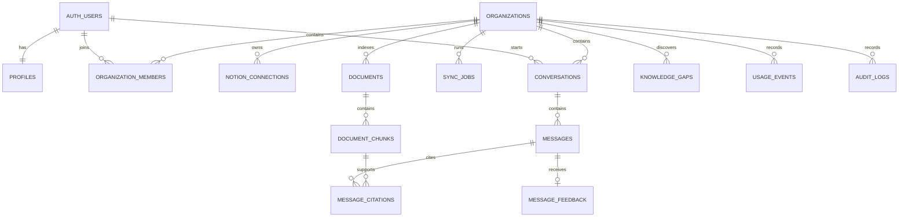

# AI Company Knowledge & Operations Assistant
## Database Schema

**Version:** 1.0  
**Database:** Supabase PostgreSQL with pgvector  
**Vector dimension:** 1536

---

## 13. Database Schema

## 13.1 Entity relationship diagram



## 13.2 Table catalog

### `profiles`

Extends `auth.users`.

| Column | Type | Notes |
|---|---|---|
| `id` | `uuid` | PK and FK to `auth.users.id` |
| `full_name` | `text` | Nullable |
| `avatar_url` | `text` | Nullable |
| `created_at` | `timestamptz` | Default now |
| `updated_at` | `timestamptz` | Default now |

### `organizations`

| Column | Type | Notes |
|---|---|---|
| `id` | `uuid` | PK |
| `name` | `text` | Required |
| `slug` | `text` | Unique |
| `owner_user_id` | `uuid` | FK to auth user |
| `plan` | `text` | Default `portfolio` |
| `ai_provider` | `text` | `gemini` or `openai` |
| `generation_model` | `text` | Provider model ID |
| `embedding_provider` | `text` | Provider ID |
| `embedding_model` | `text` | Model ID |
| `embedding_dimension` | `integer` | Must equal 1536 |
| `retrieval_threshold` | `real` | Configurable |
| `created_at` | `timestamptz` | Default now |
| `updated_at` | `timestamptz` | Default now |

### `organization_members`

| Column | Type | Notes |
|---|---|---|
| `organization_id` | `uuid` | Composite PK |
| `user_id` | `uuid` | Composite PK |
| `role` | `text` | owner/admin/member |
| `status` | `text` | invited/active/disabled |
| `invited_by` | `uuid` | Nullable |
| `joined_at` | `timestamptz` | Nullable |
| `created_at` | `timestamptz` | Default now |

### `notion_connections`

| Column | Type | Notes |
|---|---|---|
| `id` | `uuid` | PK |
| `organization_id` | `uuid` | FK |
| `notion_workspace_id` | `text` | External workspace ID |
| `notion_workspace_name` | `text` | Display name |
| `notion_workspace_icon` | `text` | Nullable |
| `bot_id` | `text` | Nullable |
| `access_token_ciphertext` | `text` | App-encrypted |
| `refresh_token_ciphertext` | `text` | Nullable |
| `token_expires_at` | `timestamptz` | Nullable |
| `status` | `text` | connected/error/disconnected |
| `last_synced_at` | `timestamptz` | Nullable |
| `last_error` | `text` | Sanitized |
| `created_at` | `timestamptz` | Default now |
| `updated_at` | `timestamptz` | Default now |

Unique constraint:

```text
organization_id + notion_workspace_id
```

### `documents`

| Column | Type | Notes |
|---|---|---|
| `id` | `uuid` | PK |
| `organization_id` | `uuid` | FK |
| `connection_id` | `uuid` | FK |
| `source_type` | `text` | `notion_page` |
| `external_id` | `text` | Notion page ID |
| `parent_external_id` | `text` | Nullable |
| `title` | `text` | Required |
| `source_url` | `text` | Notion URL |
| `normalized_content` | `text` | Extracted searchable text |
| `content_hash` | `text` | SHA-256 |
| `metadata` | `jsonb` | Properties and hierarchy |
| `source_created_at` | `timestamptz` | Nullable |
| `source_updated_at` | `timestamptz` | Nullable |
| `last_indexed_at` | `timestamptz` | Nullable |
| `sync_status` | `text` | pending/syncing/indexed/failed/archived |
| `is_archived` | `boolean` | Default false |
| `last_error` | `text` | Sanitized |
| `created_at` | `timestamptz` | Default now |
| `updated_at` | `timestamptz` | Default now |

Unique constraint:

```text
organization_id + source_type + external_id
```

### `document_chunks`

| Column | Type | Notes |
|---|---|---|
| `id` | `uuid` | PK |
| `organization_id` | `uuid` | Denormalized tenant key |
| `document_id` | `uuid` | FK |
| `chunk_index` | `integer` | Deterministic order |
| `content` | `text` | Chunk text |
| `content_hash` | `text` | SHA-256 |
| `token_count` | `integer` | Estimated tokens |
| `heading_path` | `text[]` | Heading hierarchy |
| `metadata` | `jsonb` | Source metadata |
| `embedding_model` | `text` | Model used |
| `embedding` | `vector(1536)` | pgvector |
| `created_at` | `timestamptz` | Default now |

Unique constraint:

```text
document_id + chunk_index + content_hash
```

### `sync_jobs`

| Column | Type | Notes |
|---|---|---|
| `id` | `uuid` | PK |
| `organization_id` | `uuid` | FK |
| `connection_id` | `uuid` | Nullable FK |
| `requested_by` | `uuid` | Nullable for scheduled jobs |
| `job_type` | `text` | full/incremental/page/delete |
| `status` | `text` | queued/running/succeeded/failed/cancelled |
| `celery_task_id` | `text` | Nullable historical queue task identifier |
| `total_items` | `integer` | Default 0 |
| `processed_items` | `integer` | Default 0 |
| `failed_items` | `integer` | Default 0 |
| `error_code` | `text` | Nullable |
| `error_message` | `text` | Sanitized |
| `started_at` | `timestamptz` | Nullable |
| `completed_at` | `timestamptz` | Nullable |
| `created_at` | `timestamptz` | Default now |

### `conversations`

| Column | Type | Notes |
|---|---|---|
| `id` | `uuid` | PK |
| `organization_id` | `uuid` | FK |
| `user_id` | `uuid` | FK |
| `title` | `text` | Generated or first question |
| `created_at` | `timestamptz` | Default now |
| `updated_at` | `timestamptz` | Default now |
| `archived_at` | `timestamptz` | Nullable |

### `messages`

| Column | Type | Notes |
|---|---|---|
| `id` | `uuid` | PK |
| `conversation_id` | `uuid` | FK |
| `organization_id` | `uuid` | Denormalized tenant key |
| `role` | `text` | user/assistant/system |
| `content` | `text` | Required |
| `status` | `text` | pending/completed/failed |
| `confidence` | `text` | high/medium/low/insufficient |
| `model_provider` | `text` | Nullable |
| `model_name` | `text` | Nullable |
| `prompt_tokens` | `integer` | Nullable |
| `completion_tokens` | `integer` | Nullable |
| `latency_ms` | `integer` | Nullable |
| `error_code` | `text` | Nullable |
| `created_at` | `timestamptz` | Default now |

### `message_citations`

| Column | Type | Notes |
|---|---|---|
| `id` | `uuid` | PK |
| `message_id` | `uuid` | Assistant message FK |
| `document_id` | `uuid` | FK |
| `chunk_id` | `uuid` | FK |
| `citation_order` | `integer` | UI order |
| `quote_excerpt` | `text` | Short supporting excerpt |
| `similarity_score` | `real` | Retrieval score |
| `created_at` | `timestamptz` | Default now |

### `message_feedback`

| Column | Type | Notes |
|---|---|---|
| `id` | `uuid` | PK |
| `message_id` | `uuid` | Unique FK |
| `organization_id` | `uuid` | FK |
| `user_id` | `uuid` | FK |
| `rating` | `text` | helpful/unhelpful |
| `reason` | `text` | Nullable |
| `comment` | `text` | Nullable |
| `created_at` | `timestamptz` | Default now |

### `knowledge_gaps`

| Column | Type | Notes |
|---|---|---|
| `id` | `uuid` | PK |
| `organization_id` | `uuid` | FK |
| `representative_question` | `text` | Required |
| `question_embedding` | `vector(1536)` | Optional grouping vector |
| `occurrence_count` | `integer` | Default 1 |
| `status` | `text` | open/reviewing/resolved/dismissed |
| `resolution_notes` | `text` | Nullable |
| `first_seen_at` | `timestamptz` | Default now |
| `last_seen_at` | `timestamptz` | Default now |
| `resolved_at` | `timestamptz` | Nullable |

### `usage_events`

| Column | Type | Notes |
|---|---|---|
| `id` | `uuid` | PK |
| `organization_id` | `uuid` | FK |
| `user_id` | `uuid` | Nullable |
| `event_type` | `text` | chat/sync/embedding/etc. |
| `quantity` | `integer` | Default 1 |
| `provider` | `text` | Nullable |
| `model` | `text` | Nullable |
| `metadata` | `jsonb` | No secrets |
| `created_at` | `timestamptz` | Default now |

### `audit_logs`

| Column | Type | Notes |
|---|---|---|
| `id` | `uuid` | PK |
| `organization_id` | `uuid` | FK |
| `actor_user_id` | `uuid` | Nullable |
| `action` | `text` | e.g. notion.connected |
| `target_type` | `text` | Nullable |
| `target_id` | `text` | Nullable |
| `metadata` | `jsonb` | Sanitized |
| `created_at` | `timestamptz` | Default now |

---

## 13.3 Initial PostgreSQL migration skeleton

```sql
create extension if not exists vector with schema extensions;
create extension if not exists pgcrypto with schema extensions;

create type public.organization_role as enum ('owner', 'admin', 'member');
create type public.member_status as enum ('invited', 'active', 'disabled');
create type public.document_status as enum (
  'pending',
  'syncing',
  'indexed',
  'failed',
  'archived'
);
create type public.sync_job_status as enum (
  'queued',
  'running',
  'succeeded',
  'failed',
  'cancelled'
);
create type public.message_role as enum ('user', 'assistant', 'system');
create type public.message_status as enum ('pending', 'completed', 'failed');
create type public.answer_confidence as enum (
  'high',
  'medium',
  'low',
  'insufficient'
);

create table public.profiles (
  id uuid primary key references auth.users(id) on delete cascade,
  full_name text,
  avatar_url text,
  created_at timestamptz not null default now(),
  updated_at timestamptz not null default now()
);

create table public.organizations (
  id uuid primary key default gen_random_uuid(),
  name text not null check (char_length(name) between 2 and 100),
  slug text not null unique,
  owner_user_id uuid not null references auth.users(id),
  plan text not null default 'portfolio',
  ai_provider text not null default 'gemini',
  generation_model text not null,
  embedding_provider text not null default 'gemini',
  embedding_model text not null,
  embedding_dimension integer not null default 1536
    check (embedding_dimension = 1536),
  retrieval_threshold real not null default 0.68
    check (retrieval_threshold >= 0 and retrieval_threshold <= 1),
  created_at timestamptz not null default now(),
  updated_at timestamptz not null default now()
);

create table public.organization_members (
  organization_id uuid not null references public.organizations(id) on delete cascade,
  user_id uuid not null references auth.users(id) on delete cascade,
  role public.organization_role not null default 'member',
  status public.member_status not null default 'active',
  invited_by uuid references auth.users(id),
  joined_at timestamptz,
  created_at timestamptz not null default now(),
  primary key (organization_id, user_id)
);

create table public.notion_connections (
  id uuid primary key default gen_random_uuid(),
  organization_id uuid not null references public.organizations(id) on delete cascade,
  notion_workspace_id text not null,
  notion_workspace_name text not null,
  notion_workspace_icon text,
  bot_id text,
  access_token_ciphertext text not null,
  refresh_token_ciphertext text,
  token_expires_at timestamptz,
  status text not null default 'connected',
  last_synced_at timestamptz,
  last_error text,
  created_at timestamptz not null default now(),
  updated_at timestamptz not null default now(),
  unique (organization_id, notion_workspace_id)
);

create table public.documents (
  id uuid primary key default gen_random_uuid(),
  organization_id uuid not null references public.organizations(id) on delete cascade,
  connection_id uuid not null references public.notion_connections(id) on delete cascade,
  source_type text not null default 'notion_page',
  external_id text not null,
  parent_external_id text,
  title text not null,
  source_url text,
  normalized_content text not null default '',
  content_hash text not null,
  metadata jsonb not null default '{}'::jsonb,
  source_created_at timestamptz,
  source_updated_at timestamptz,
  last_indexed_at timestamptz,
  sync_status public.document_status not null default 'pending',
  is_archived boolean not null default false,
  last_error text,
  created_at timestamptz not null default now(),
  updated_at timestamptz not null default now(),
  unique (organization_id, source_type, external_id)
);

create table public.document_chunks (
  id uuid primary key default gen_random_uuid(),
  organization_id uuid not null references public.organizations(id) on delete cascade,
  document_id uuid not null references public.documents(id) on delete cascade,
  chunk_index integer not null check (chunk_index >= 0),
  content text not null,
  content_hash text not null,
  token_count integer not null check (token_count >= 0),
  heading_path text[] not null default '{}',
  metadata jsonb not null default '{}'::jsonb,
  embedding_model text not null,
  embedding extensions.vector(1536) not null,
  created_at timestamptz not null default now(),
  unique (document_id, chunk_index, content_hash)
);

create index document_chunks_org_idx
  on public.document_chunks (organization_id);

create index document_chunks_document_idx
  on public.document_chunks (document_id);

create index document_chunks_embedding_hnsw_idx
  on public.document_chunks
  using hnsw (embedding extensions.vector_cosine_ops);

create table public.sync_jobs (
  id uuid primary key default gen_random_uuid(),
  organization_id uuid not null references public.organizations(id) on delete cascade,
  connection_id uuid references public.notion_connections(id) on delete set null,
  requested_by uuid references auth.users(id) on delete set null,
  job_type text not null,
  status public.sync_job_status not null default 'queued',
  celery_task_id text,
  total_items integer not null default 0,
  processed_items integer not null default 0,
  failed_items integer not null default 0,
  error_code text,
  error_message text,
  started_at timestamptz,
  completed_at timestamptz,
  created_at timestamptz not null default now()
);

create table public.conversations (
  id uuid primary key default gen_random_uuid(),
  organization_id uuid not null references public.organizations(id) on delete cascade,
  user_id uuid not null references auth.users(id) on delete cascade,
  title text not null default 'New conversation',
  created_at timestamptz not null default now(),
  updated_at timestamptz not null default now(),
  archived_at timestamptz
);

create table public.messages (
  id uuid primary key default gen_random_uuid(),
  conversation_id uuid not null references public.conversations(id) on delete cascade,
  organization_id uuid not null references public.organizations(id) on delete cascade,
  role public.message_role not null,
  content text not null,
  status public.message_status not null default 'completed',
  confidence public.answer_confidence,
  model_provider text,
  model_name text,
  prompt_tokens integer,
  completion_tokens integer,
  latency_ms integer,
  error_code text,
  created_at timestamptz not null default now()
);

create table public.message_citations (
  id uuid primary key default gen_random_uuid(),
  message_id uuid not null references public.messages(id) on delete cascade,
  document_id uuid not null references public.documents(id) on delete cascade,
  chunk_id uuid not null references public.document_chunks(id) on delete cascade,
  citation_order integer not null,
  quote_excerpt text,
  similarity_score real,
  created_at timestamptz not null default now(),
  unique (message_id, citation_order)
);

create table public.message_feedback (
  id uuid primary key default gen_random_uuid(),
  message_id uuid not null unique references public.messages(id) on delete cascade,
  organization_id uuid not null references public.organizations(id) on delete cascade,
  user_id uuid not null references auth.users(id) on delete cascade,
  rating text not null check (rating in ('helpful', 'unhelpful')),
  reason text,
  comment text,
  created_at timestamptz not null default now()
);

create table public.knowledge_gaps (
  id uuid primary key default gen_random_uuid(),
  organization_id uuid not null references public.organizations(id) on delete cascade,
  representative_question text not null,
  question_embedding extensions.vector(1536),
  occurrence_count integer not null default 1,
  status text not null default 'open'
    check (status in ('open', 'reviewing', 'resolved', 'dismissed')),
  resolution_notes text,
  first_seen_at timestamptz not null default now(),
  last_seen_at timestamptz not null default now(),
  resolved_at timestamptz
);

create table public.usage_events (
  id uuid primary key default gen_random_uuid(),
  organization_id uuid not null references public.organizations(id) on delete cascade,
  user_id uuid references auth.users(id) on delete set null,
  event_type text not null,
  quantity integer not null default 1,
  provider text,
  model text,
  metadata jsonb not null default '{}'::jsonb,
  created_at timestamptz not null default now()
);

create table public.audit_logs (
  id uuid primary key default gen_random_uuid(),
  organization_id uuid not null references public.organizations(id) on delete cascade,
  actor_user_id uuid references auth.users(id) on delete set null,
  action text not null,
  target_type text,
  target_id text,
  metadata jsonb not null default '{}'::jsonb,
  created_at timestamptz not null default now()
);
```

## 13.4 Vector search function

```sql
create or replace function public.match_document_chunks(
  p_organization_id uuid,
  p_query_embedding extensions.vector(1536),
  p_match_count integer default 8,
  p_min_similarity real default 0.68
)
returns table (
  chunk_id uuid,
  document_id uuid,
  content text,
  heading_path text[],
  metadata jsonb,
  similarity real
)
language sql
stable
security invoker
set search_path = ''
as $$
  select
    dc.id as chunk_id,
    dc.document_id,
    dc.content,
    dc.heading_path,
    dc.metadata,
    1 - (dc.embedding <=> p_query_embedding) as similarity
  from public.document_chunks dc
  join public.documents d on d.id = dc.document_id
  where dc.organization_id = p_organization_id
    and d.organization_id = p_organization_id
    and d.sync_status = 'indexed'
    and d.is_archived = false
    and 1 - (dc.embedding <=> p_query_embedding) >= p_min_similarity
  order by dc.embedding <=> p_query_embedding
  limit least(greatest(p_match_count, 1), 30);
$$;
```

## 13.5 Tenant isolation rules

- Every tenant-owned table contains `organization_id`.
- Every API route resolves membership before performing work.
- Every repository query requires an organization ID argument.
- Never accept an organization ID as trusted only because it appears in the request body.
- Confirm the authenticated user belongs to the requested organization.
- The Supabase service-role key is backend-only.
- Row Level Security should be enabled as defense in depth.
- Background tasks must include and validate the organization ID.
- Citation validation must verify that the cited chunk belongs to the same organization and message context.
- Tests must include attempted cross-organization access.

### Helper membership function

```sql
create or replace function public.is_org_member(target_org_id uuid)
returns boolean
language sql
stable
security definer
set search_path = ''
as $$
  select exists (
    select 1
    from public.organization_members om
    where om.organization_id = target_org_id
      and om.user_id = auth.uid()
      and om.status = 'active'
  );
$$;
```

RLS policies should use this helper for user-facing tables. Background jobs use the backend service role and must enforce tenancy in application code.

---
